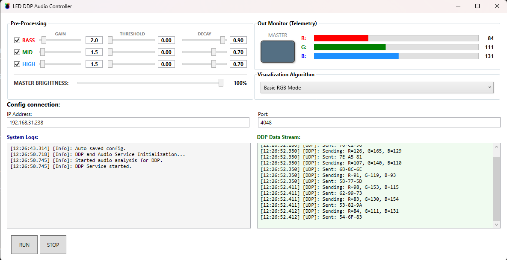

  
  <h1>LED DDP Audio Controller</h1>
  
A zero-latency, FFT-based audio visualizer for DDP-compatible LED strips.

---

Hey! I built this tool because I wanted my room's LED strips to actually *feel* the music, rather than just blinking randomly to the volume. 

This is a lightweight desktop app written in C# (WPF) that captures your system's audio in real-time, analyzes the frequencies using Fast Fourier Transform, and sends perfectly synced color data directly to your LED controller using the fast UDP DDP protocol. 

It works flawlessly with firmwares like **OpenBeken**.

## UI

  

## Key Features
* **Zero Latency:** Uses DDP over UDP to push pixels instantly without the overhead of HTTP APIs.
* **Smart Frequency Separation:** Differentiates between deep bass kicks and high-frequency hats.
* **Xenon-Flash Effect:** Custom decay algorithm makes bass hits look like massive stage blinders.
* **Plug & Play Audio:** Captures clean system audio via WASAPI loopback (no virtual audio cables needed).
* **Lightweight UI:** Simple WPF interface with real-time telemetry and logging.

## Quick Start
You don't need to compile anything if you just want to use the app!

1. Head over to the [Releases](../../releases) tab.
2. Download the latest `.zip` file (I recommend the **Standalone** version for a plug-and-play experience).
3. Extract the folder and run `LED_DDP_DRIVER.exe`.
4. Enter the IP address of your WLED/OpenBeken device and hit start!

> **Note on Windows SmartScreen:** Since this is a free, hobbyist open-source project, the `.exe` isn't signed with an expensive certificate. Windows might warn you about running an unrecognized app. Just click **More info -> Run anyway**.

## Building from source
If you want to tinker with the code, the core logic is super simple to follow. 
1. Clone the repo.
2. Open the `.sln` file in Visual Studio 2026.
3. Make sure the target framework is set to `.NET 10.0` (or your current version).
4. Hit **Build**!

## Enjoy the light show!